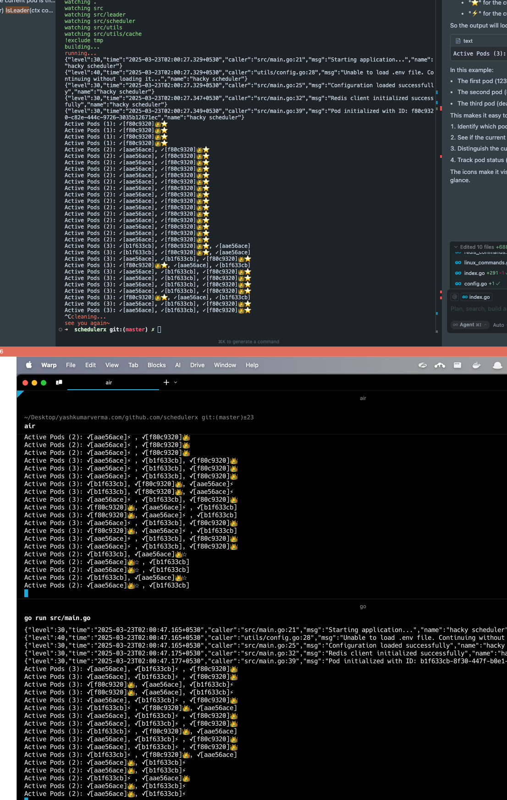

# Schedulerx 
> The objective of this project is to implement a job scheduler that will run various tasks (commands) based on their cron schedules. The scheduler must be scalable and function correctly in a multi-pod environment, ensuring that each scheduled command runs exactly once at the scheduled time, even if multiple servers are executing the scheduler service.

## Overview
- Command : something that has to be run
- Job : execution unit of a command. For a command to run, a job needs to created and executed.
- Config: loaded from `utils/config.go` `struct::Config`
- All supported commands are added in `registerCommands`. All supported commands are declared in `command/command.go`

## Multi Pod Support
- By design, each binary is capable of being a leader or a follower.
- When binaries come alive, they generate a ID, or get a pre-defined ID from config and register themselves.
- Post registration, the first pod to register is selected as leader.
- When other pods come up, since their registration timestamp is after the leader's timestamp, they identify themselves as follower.
- 

## Flow
- Commands have schedules defined in cron format.
- Based on command schedules, jobs are created (and sync'd to redis)
- These jobs are assigned by leader to alive pods.
- Alive pods pick jobs that are assigned to them, and execute them.
- For sake of design, the commands aren't actually run but a time.sleep is added to simulate it.
- At a given time, only K jobs are scheduled per scheduler, so it knows the next K jobs it has to run. This also helps avoid agressive reassignment if pods die.

## Common FAQ
- Where is data stored: on redis, being transient in nature. Can be used with AOF mode to persist if required.
- Can duplicate jobs be scheduled?
  - Each job has an ID, created by combination of command and timestamp when its supposed to run based on CRON.
  - This id is stored in sorted set. Field is job id, and score is the timestamp when its supposed to be run.
  - So when job is attempted to be inserted again, it doesn't impact the expected flow of operations.
- Are all jobs assigned by leader?
  - No, leader assigns only K jobs based on the config.
- How is exactly once execution guarenteed?
  - Two checks are put in place.
  - One is a pod only executes jobs which are assigned against its id. So PodA has no interaction with PodB's jobs.
  - The pod assignment is a property of the Job, so at one time there can only be 1 pod assigned.
  - In addition to this, due to any bug in scheduler logic, if two leaders coexist and try to assign same job to different pods one after the other (dirty write problem) and those pods pick the jobs to be processed, the execution engine takes a lock on job id before executing. If the lock cannot be obtained, the job is not executed.
